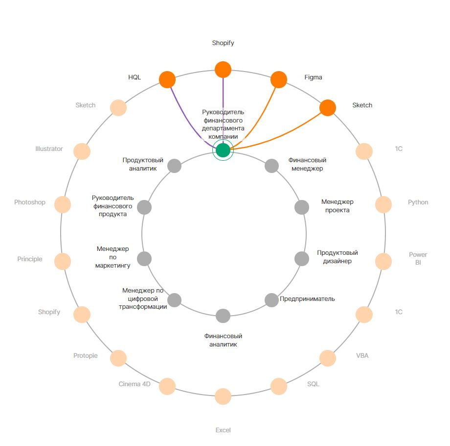

# .ru

### Описание: 
Тестовое задание для Правительство Москвы. Веб сервис отображающий взаимосвязь между компетенциями и связанными навыками. 

Приложение написано на популярном фреймворке REACT.

### Технологический стек
* :point_right: React
* :point_right: HTML
* :point_right: CSS
##### версия языка: :ru:


### Запускает приложение в режиме разработки

```sh
npm run dev
Откройте http://localhost:5173/ , чтобы просмотреть его в браузере.
```

### Сборка приложения

```sh
npm run build
```
* [Ссылка на сайт](https:https://aksenov-m.github.io/Moscow-gov/)


